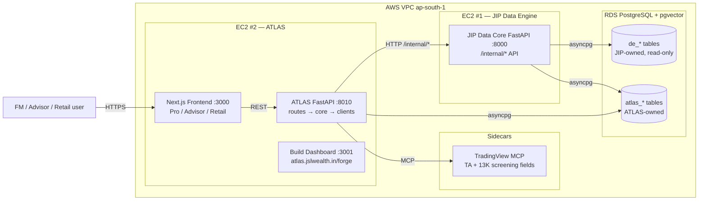
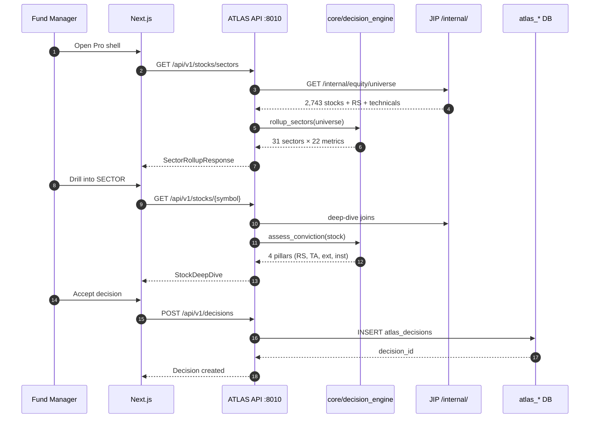
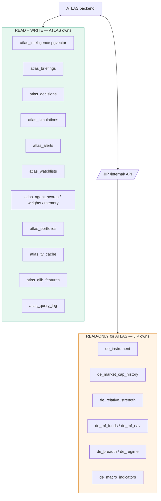
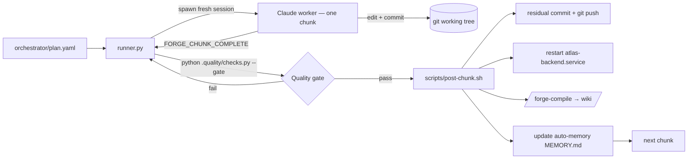

# ATLAS Architecture

This document is the visual companion to [`ATLAS-DEFINITIVE-SPEC.md`](../ATLAS-DEFINITIVE-SPEC.md)
and [`CLAUDE.md`](../CLAUDE.md). It captures the deployment topology, request
flow, and data ownership boundaries as Mermaid diagrams.

---

## 1. Service topology

ATLAS runs on its own EC2 host inside the same VPC as the JIP Data Core, so
internal API calls are sub-millisecond. ATLAS never touches `de_*` tables
directly — JIP owns the warehouse, ATLAS owns `atlas_*`.

---

## 2. Request flow — Market → Sector → Stock → Decision (V1)

---

## 3. Data ownership boundary

**Hard rule:** any code that imports `de_*` directly into ATLAS is rejected by
the quality gate. All warehouse reads go through `backend/clients/jip_client.py`.

---

## 4. Forge build pipeline

The pipeline enforces the **post-chunk sync invariant**: a chunk is not DONE
until git, EC2, the Forge wiki, and `MEMORY.md` all agree.

---

## 5. Quality gate dimensions

| Dimension     | Weight | Floor | What it measures                                  |
|---------------|--------|-------|---------------------------------------------------|
| security      | 15%    | 80    | secrets, auth, OWASP-style checks                 |
| code          | 20%    | 70    | lint, types, complexity, duplication              |
| architecture  | 20%    | 80    | layering, contract adherence, no `de_*` imports   |
| frontend      | 15%    | 70    | bundle size, a11y, Lighthouse, Playwright         |
| devops        | 15%    | 70    | CI, Dockerfile, migrations, deploy scripts        |
| docs          | 5%     | 75    | README, CLAUDE.md, API docstrings, ADRs           |
| api           | 10%    | —     | contract coverage, endpoint test depth            |

Targets are defined in `orchestrator/plan.yaml` and enforced by
`.quality/checks.py`. See [`.quality/standards.md`](../.quality/standards.md)
for the rubric.

---

## 6. Further reading

- [`ATLAS-DEFINITIVE-SPEC.md`](../ATLAS-DEFINITIVE-SPEC.md) — full 4,200-line spec
- [`CLAUDE.md`](../CLAUDE.md) — operational rules and schema facts
- [`docs/adr/`](./adr/) — architecture decision records
- [`CONTRIBUTING.md`](../CONTRIBUTING.md) — contributor workflow
